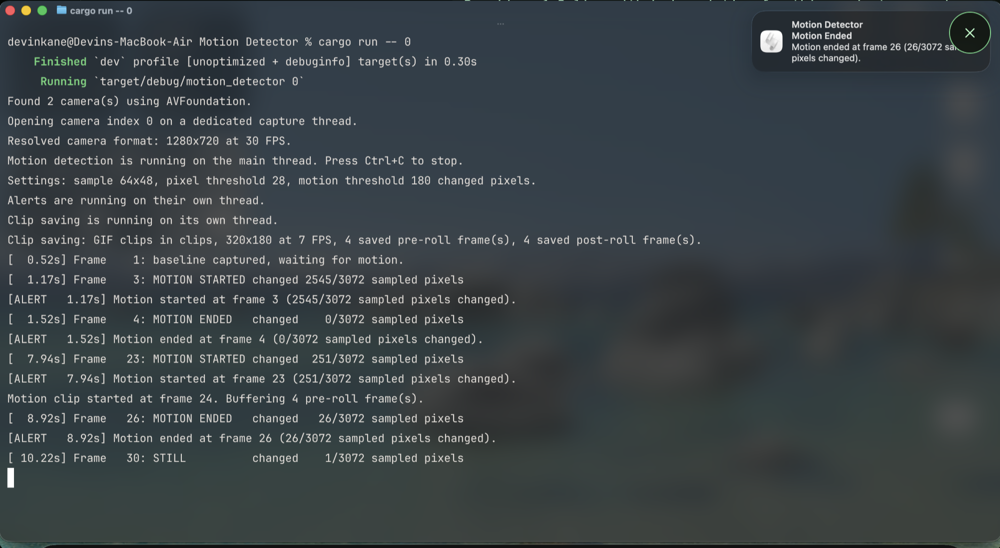

# Motion Detector

This is a Rust project I made that uses a Mac webcam to detect motion, save clips, and send desktop notifications.



## About

I made this project to practice Rust and learn more about threads in a real program instead of only doing small examples. The app watches a webcam feed, looks for motion by comparing frames, saves short GIF clips when motion happens, and sends alerts when motion starts and ends.

- Written in Rust
- Made for macOS webcams
- Saves motion clips into the `clips/` folder
- Uses desktop notifications for alerts
- Includes a small amount of video from before and after the motion

## What It Does

- Opens your webcam and reads frames live
- Checks for motion by comparing grayscale frame samples
- Saves GIF clips when motion is detected
- Sends notifications when motion starts and when it ends
- Uses multiple threads for capture, saving clips, and alerts

## How It Works

The program is split into a few main parts:

1. The capture thread opens the webcam and sends frames through a bounded channel.
2. The main thread receives frames and checks for motion using sampled grayscale pixel differences.
3. The clip-saver thread buffers frames and writes motion-triggered GIF clips.
4. The alert thread sends desktop notifications when motion starts or ends.

## Output

- Motion clips are saved in the `clips/` directory
- Clips are currently saved as GIF files
- Desktop notifications appear when motion starts and ends
- The terminal also prints motion updates while the app is running

## How To Run

### Prerequisites

- macOS
- Rust and Cargo installed on your computer
- Webcam access enabled for the app or terminal running the program
- Notification permission enabled if you want alerts to show up

### Build the project

```bash
cargo build
```

### Run with the default camera

```bash
cargo run -- 0
```

This uses camera index `0`, which is usually the main webcam.

### Run a short test

```bash
cargo run -- 0 300
```

In this command, the first number is the camera index and the second number is the maximum number of frames to process.

### What should happen

When the program starts, it should:

- Open the selected webcam
- Start the capture, motion detection, clip saving, and alert workflow
- Print motion activity to the terminal
- Save clips into `clips/`
- Show desktop notifications for motion start and end events

## Troubleshooting

### Camera Permission

If macOS blocks webcam access:

1. Open `System Settings`
2. Go to `Privacy & Security`
3. Open `Camera`
4. Enable access for the terminal or app running the program

### Notifications Not Appearing

If alerts do not appear:

1. Check macOS notification settings for the terminal or app running the project
2. Re-run the program after granting notification permission
